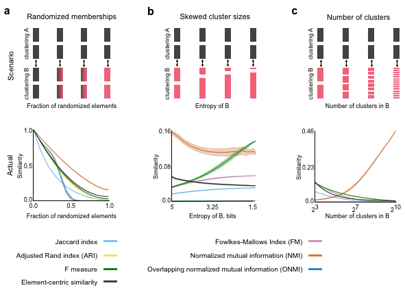
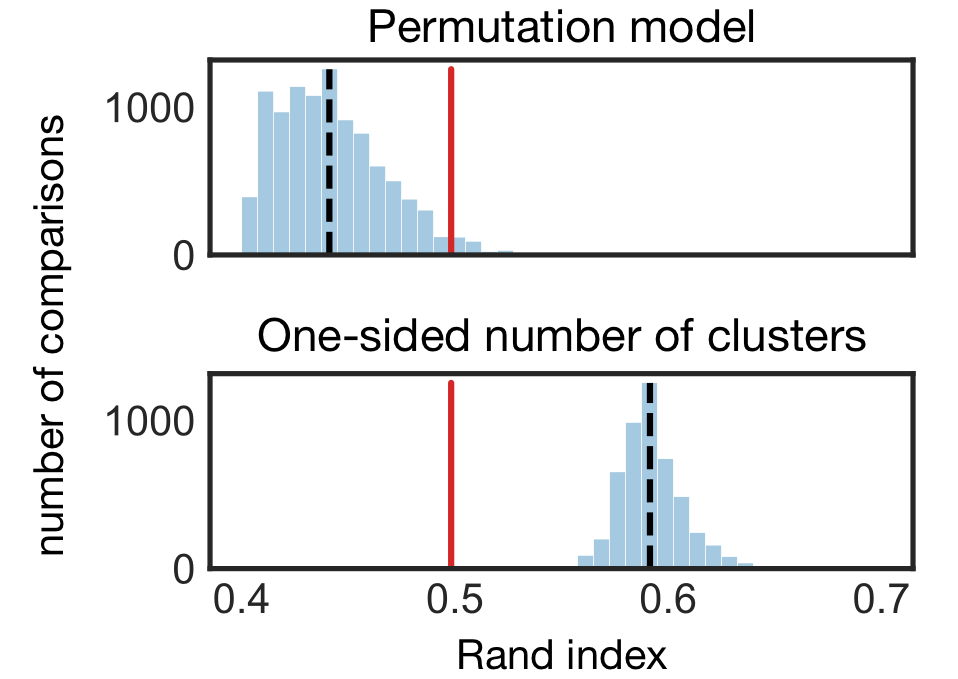

# Summary

Clustering is a primary method to reveal the structure of data [@Jain1999clustering]. To understand, evaluate, and leverage data clusterings, we need to quantitatively compare them. Clustering comparison is the basis for method evaluation, consensus clustering, and tracking the temporal evolution of clusters, among many other tasks. For instance, clustering method evaluation is usually achieved by comparing the method's result to a planted reference clustering, assuming that the more similar the method's solution is to the reference clustering, the better the method. Despite the importance of clustering comparison, no consensus has been reached for a standardized assessment; each similarity measure rewards and penalizes different criteria, sometimes producing contradictory conclusions. Each scientific community has adopted their own standard practices, often without considering whether the measures' underlying assumptions are appropriate for the given task.

Clustering similarity measures can be classified based on the cluster types: i) *partitions* that group elements into non-overlapping clusters, ii) *hierarchical clusterings* that group elements into a nested series of partitions (a.k.a. dendrogram), or iii) *overlapping clusterings* with elements belonging to multiple clusters. Furthermore, in order to establish a baseline and interpret the similarity score, it is often argued that clustering similarity should be assessed in the context of a random ensemble of clusterings. Such a correction procedure requires two choices: *a model for random clusterings* and *how clusterings are drawn from the random model*. With few exceptions, similarity measures are only designed to compare clusterings of the same type, and the decisions required for the correction procedure are usually ignored or relegated to the status of technical trivialities [@Gates2017impact].

Here, we introduce *CluSim*, a python package providing a unified library of 20+ clustering similarity measures for partitions, dendrograms, and overlapping clusterings. To our knowledge, this package constitutes the first collection of clustering similarity measures for all three clustering types and extended access to random models of clusterings [@Gates2018element]. We illustrate the use of the package through two examples: comparing clusterings of Gene Expression data in the context of different random models, and element-centric comparisons between a set of phylogentic trees (dendrograms).

# Examples

The basic class in the *CluSim* package is a *Clustering*, or an assignment of labeled elements (i.e. data points or network vertices) into clusters (the groups). Hierarchical *Clusterings* also contain a dendrogram, or more generally an acyclic graph, capturing the nested structure of the clusters. In *CluSim*, a *Clustering* can be instantiated from 7 different common formats, including full support for `scipy`, *scikit-learn*, and *dendropy* clustering formats [@scipy; @scikitlearn; @Sukumaran2010dendropy].

*CluSim* provides more than 20 clustering similarity and distance measures for the comparison between two *Clusterings*. All similarity measures produce a score in the range $[0,1]$, where $1$ indicates identical clusterings and $0$ indicates maximally dissimilar clusterings. See the online documentation for a detailed list and mathematical definitions of these similarity measures.

To facilitate comparisons within a set of clusterings, the *CluSim* package provides two implementations of the correction for chance. Analytic solutions are available for the Rand index and Normalized Mutual Information using five random models: the permutation model, both one-sided and two-sided models for clusterings with a fixed number of clusters, and both one-sided and two-sided models for all random clusterings [@Hubert1985adjrand; @Vinh2009nmicorrection; @Gates2017impact]. For all other similarity measures, the correction for chance is estimated by randomly sampling the random ensemble of *Clusterings* using the provided random Clustering generators.

**Evaluating clustering comparisons w.r.t. random models.** A comparison using the Rand Index between the classification of cancer types and clustering labels derived using Hierarchical Clustering on gene expression data ($0.5$, red). above, Pairwise comparisons between samples from the Permutation model (blue, see [@Hubert1985adjrand]) with mean $0.44$ (black). below, Pairwise comparisons between samples from the one-sided model with a Fixed Number of Clusters (blue, see [@Gates2017impact]) with mean $0.59$ (black). The Permutation model suggests Hierarchical Clustering is more similar to the ground truth than a random clustering, while the one-sized fixed number of clusterings model, the more appropriate model for this scenario, reveals that the result is less similar than random clusterings.

&nbsp;

In the second example, we identify the loci of gene-tree heterogeneity in an analysis of $424$ nuclear genes from $37$ eutherian mammals [@Song2012mammalphylogeny]. Specifically, we perform all pair-wise comparisons between the $424$ phylogenetic trees (dendrograms, exemplified in Fig. 2**a**) derived from individual gene sequence data [@Mirarab2014astral]. The average element-centric similarity between the trees (Fig. 2**b**) reveals their overall similarity, with few conflicts near the roots of the trees (high similarity for the scaling parameter, $r<0$), while decreasing similarity suggest greater conflicts towards the leaves (lower similarity for the scaling parameter,$r>0$). The distribution of element-wise frustration scores over the taxa reveal the loci of greatest gene tree in-congruence (Fig. 2**c**). Specifically, the 8 taxa with lowest frustration correspond to the 5 taxa previously identified with structural discrepancies (bats, shrews, and hedgehog, blue, [@Mirarab2014astral]), and the 3 taxa with the smallest bootstrapping support in the maximum-pseudolikelihood coalescent tree (pig, guinea pig, kangaroo rat, purple, [@Song2012mammalphylogeny]). This comparison provides quantitative insights into the complexities commonly observed in phylogentic data.

&nbsp;

**Element-centric comparisons of phylogenetic dendrograms**. **a**, An example phylogenetic tree for the $37$ mammals from [@Song2012mammalphylogeny]. **b**, The average element-centric similarity between $424$-gene trees for different scaling parameters reveals few conflicts near the roots (left, $r<0$), while decreasing similarity for increasing $r$ suggests greater conflicts towards the leaves (left, $r>0$). **c**, The element-centric frustration highlights the 5 taxa previously identified with structural discrepancies (bats, shrews, and hedgehog, blue, [@Mirarab2014astral]), and the 3 taxa with the smallest bootstrapping support in the maximum-pseudolikelihood coalescent tree (pig, guinea pig, kangaroo rat, purple, [@Song2012mammalphylogeny]).

&nbsp;

# Acknowledgements
The authors would like to thank Ian Wood for thoughtful discussions.

# References

